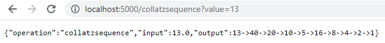
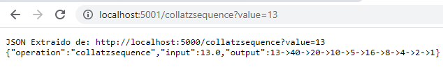
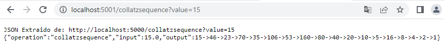
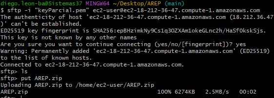
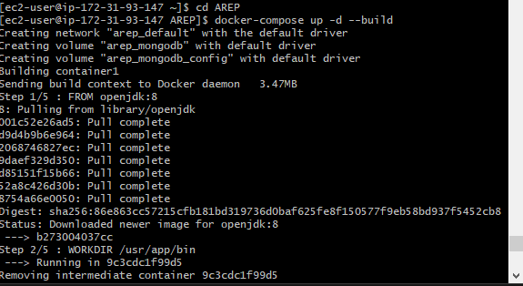
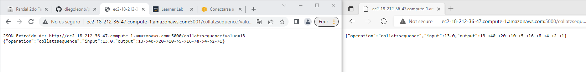

# Parcial AREP 2
# Diego Leon
## 2022-2

## Descripción

Para empezar probamos que funcione correctamente en nuestro computador local, para eso hacemos uso de localhost:5000 para nuestra respuesta en JSON de la secuencia de Collatz generada a partir de ese numero.



Como el cliente no computa la secuencia directamente sino que la delega a un servicio REST que en este caso corre en nuestro servidor local, podemos probarlo con localhost:5001 y ver que el resultado es la URL del servicio REST que se encarga de generar la secuencia y el JSON con la secuencia.






## AWS

Creamos una instancia EC2 en AWS y accedemos a ella por medio de SFTP para subir los archivos de la aplicación por medio de put.



Entramos nueva mente a la instancia por medio de SSH y ejecutamos:

```docker-compose up -d --build```



Se puede ver que la aplicación se ejecuta correctamente en el puerto 5000 y 5001.

Donde 5001 es el puerto del cliente y 5000 es el puerto del servicio REST.



